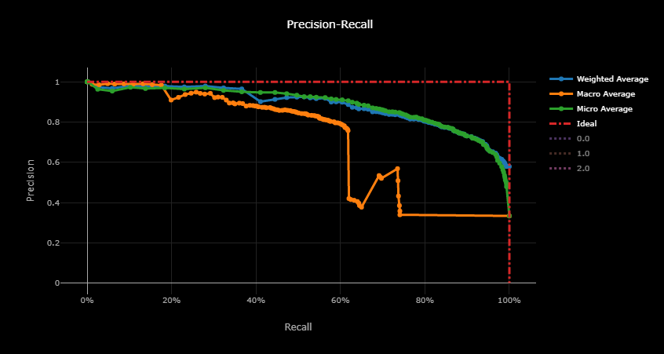
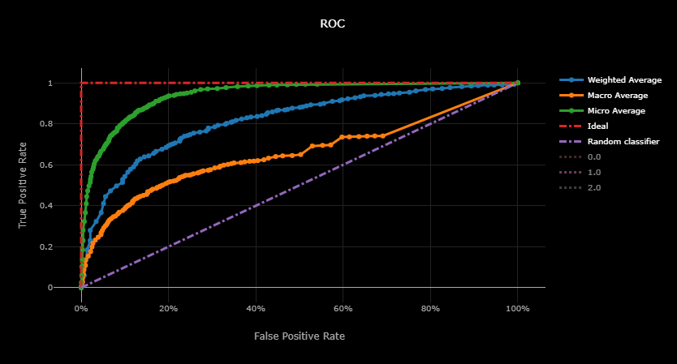
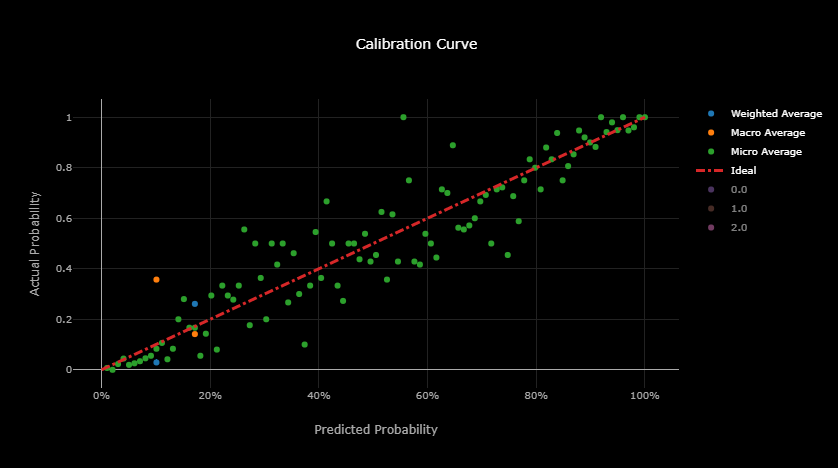
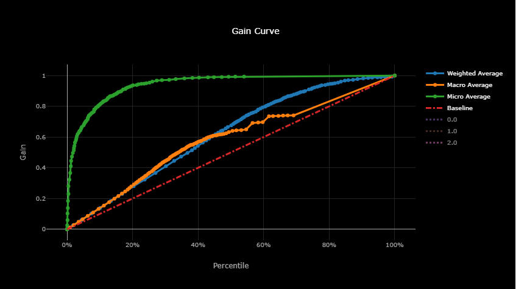
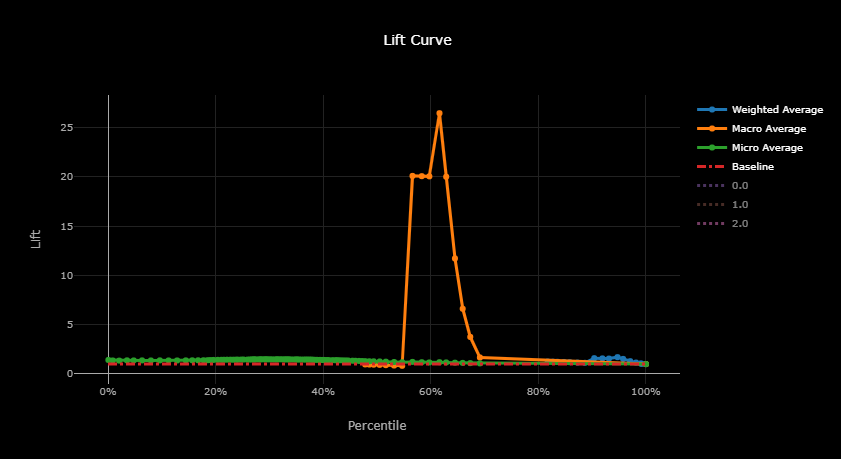

# Model Information

**Model Date:** 7/11/2019

**Run Id:** `AutoML_fb04c593-91c3-470d-84ff-5054dd576ee6_48`

**Package:** Azure Machine Learning Service - AutoML

**Best Model:** `VotingEnsemble`

**Model Description:** Using previous iterations of the machine learning model training, a SoftVoting Ensemble model was created. This uses the average of the class probabilities of previous iterations.

| Metric                           | Value  |
|:--------------------------------:|:------:|
| precision_score_micro            | 0.8044 |
| weighted_accuracy                | 0.8631 |
| AUC_macro                        | 0.8599 |
| precision_score_macro            | 0.5158 |
| recall_score_micro               | 0.8044 |
| average_precision_score_weighted | 0.8656 |
| f1_score_weighted                | 0.793  |
| norm_macro_recall                | 0.2364 |
| f1_score_micro                   | 0.8044 |
| balanced_accuracy                | 0.4909 |
| AUC_weighted                     | 0.8693 |
| recall_score_weighted            | 0.8044 |
| log_loss                         | 0.4489 |
| recall_score_macro               | 0.4909 |
| precision_score_weighted         | 0.791  |
| accuracy                         | 0.8044 |
| f1_score_macro                   | 0.4989 |
| average_precision_score_macro    | 0.6505 |
| average_precision_score_micro    | 0.8879 |
| AUC_micro                        | 0.943  |

## Confusion Matrix

| True\Pred | 0   | 1   | 2   |
| --------- | --- | --- | --- |
| **0**     | 672 | 63  | 0   |
| **1**     | 132 | 167 | 0   |
| **2**     | 6   | 3   | 0   |

## Precision-Recall Curve

## ROC Curve

## Calibration Curve

## Gain Curve

## Lift Curve

## All Previous Iterations:

| ITERATION | RUN_PREPROCESSOR      | RUN_ALGORITHM       | AUC_WEIGHTED |
|:---------:|:---------------------:|:-------------------:|:------------:|
| 48        |                       | VotingEnsemble      | 0.869259777  |
| 42        | StandardScalerWrapper | LogisticRegression  | 0.859800441  |
| 49        |                       | StackEnsemble       | 0.859465887  |
| 24        | TruncatedSVDWrapper   | LogisticRegression  | 0.856165106  |
| 21        | RobustScaler          | LogisticRegression  | 0.854450418  |
| 27        | RobustScaler          | LogisticRegression  | 0.853764616  |
| 17        | RobustScaler          | SVM                 | 0.852485773  |
| 47        | TruncatedSVDWrapper   | LogisticRegression  | 0.851623657  |
| 38        | StandardScalerWrapper | LogisticRegression  | 0.850907162  |
| 25        | RobustScaler          | LogisticRegression  | 0.85018016   |
| 32        | StandardScalerWrapper | LogisticRegression  | 0.85009573   |
| 29        | RobustScaler          | LogisticRegression  | 0.848877958  |
| 35        | TruncatedSVDWrapper   | LogisticRegression  | 0.847837479  |
| 40        | PCA                   | LogisticRegression  | 0.847126343  |
| 45        | StandardScalerWrapper | LogisticRegression  | 0.846538133  |
| 46        | StandardScalerWrapper | LogisticRegression  | 0.844902205  |
| 43        | TruncatedSVDWrapper   | LogisticRegression  | 0.839149061  |
| 39        | MaxAbsScaler          | LogisticRegression  | 0.839050687  |
| 16        | RobustScaler          | LinearSVM           | 0.837747041  |
| 31        | TruncatedSVDWrapper   | LogisticRegression  | 0.832879648  |
| 23        | MaxAbsScaler          | GradientBoosting    | 0.830051726  |
| 8         | StandardScalerWrapper | SGD                 | 0.829616989  |
| 22        | MaxAbsScaler          | LinearSVM           | 0.829106366  |
| 41        | MaxAbsScaler          | LinearSVM           | 0.828414205  |
| 18        | MaxAbsScaler          | LinearSVM           | 0.827470999  |
| 28        | StandardScalerWrapper | LightGBM            | 0.826365268  |
| 44        | StandardScalerWrapper | LogisticRegression  | 0.825388091  |
| 12        | MinMaxScaler          | LightGBM            | 0.823214682  |
| 0         | StandardScalerWrapper | SGD                 | 0.823062336  |
| 33        | MinMaxScaler          | SVM                 | 0.821629046  |
| 6         | StandardScalerWrapper | SGD                 | 0.821140862  |
| 1         | StandardScalerWrapper | SGD                 | 0.820343257  |
| 34        | StandardScalerWrapper | LightGBM            | 0.819948689  |
| 26        | StandardScalerWrapper | LightGBM            | 0.816820864  |
| 9         | MinMaxScaler          | SGD                 | 0.813992417  |
| 5         | StandardScalerWrapper | LightGBM            | 0.811134468  |
| 3         | StandardScalerWrapper | SGD                 | 0.810598996  |
| 2         | MinMaxScaler          | LightGBM            | 0.794278314  |
| 11        | MaxAbsScaler          | LightGBM            | 0.790728751  |
| 14        | MinMaxScaler          | LightGBM            | 0.789324469  |
| 4         | StandardScalerWrapper | ExtremeRandomTrees  | 0.769193196  |
| 19        | RobustScaler          | SVM                 | 0.755431759  |
| 13        | MinMaxScaler          | ExtremeRandomTrees  | 0.752183672  |
| 37        | RobustScaler          | KNN                 | 0.744495092  |
| 10        | MinMaxScaler          | RandomForest        | 0.735423771  |
| 7         | MinMaxScaler          | RandomForest        | 0.726114562  |
| 36        | RobustScaler          | RandomForest        | 0.706003947  |
| 30        | MaxAbsScaler          | LogisticRegression  | 0.687379829  |
| 15        | StandardScalerWrapper | BernoulliNaiveBayes | 0.637655313  |
| 20        | MaxAbsScaler          | SVM                 | 0.33141573   |
