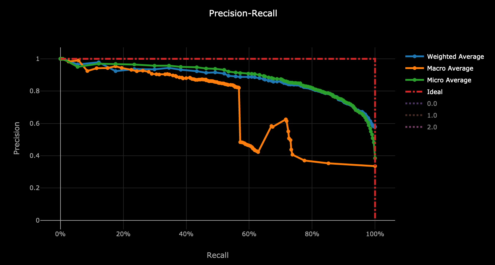
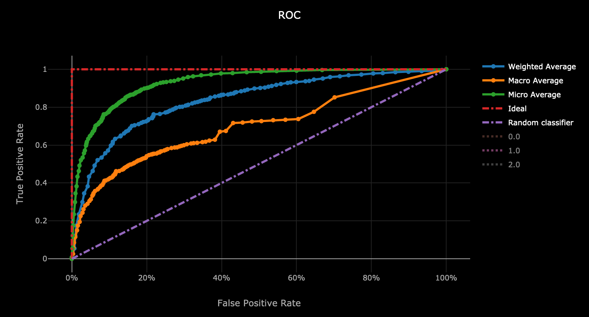
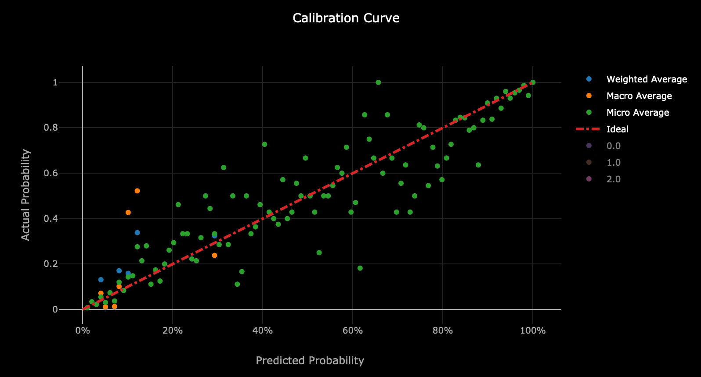
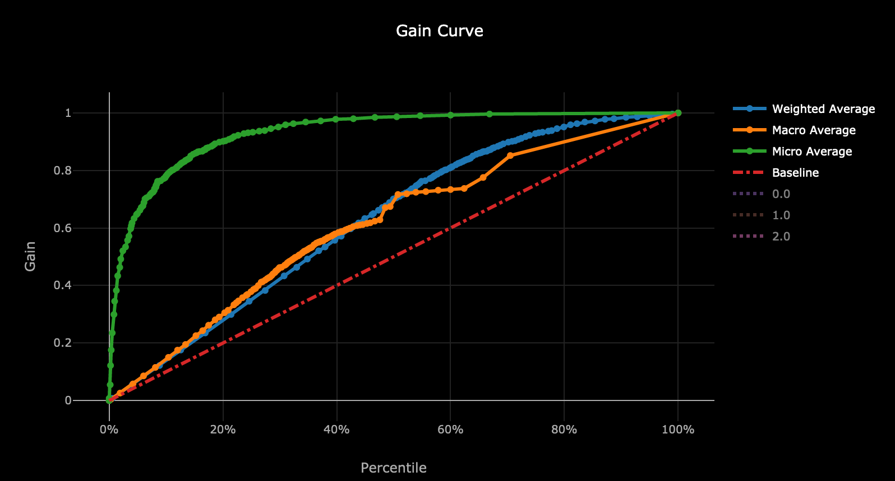
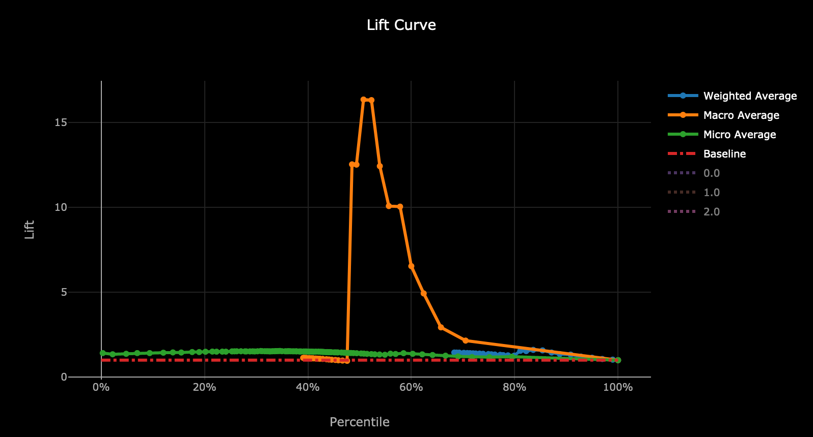

# Model Information

**Model Date:** 7/31/2019

**Run Id:** `AutoML_43d7399a-3f89-4728-b884-51be811a8e1a_98`

**Package:** Azure Machine Learning Service - AutoML

**Best Model:** `VotingEnsemble`

**Model Description:** Using previous iterations of the machine learning model training, a SoftVoting Ensemble model was created. This uses the average of the class probabilities of previous iterations.

| Metric                           | Accuracy |
|:--------------------------------:|:--------:|
| f1_score_macro                   | 0.6084   |
| AUC_micro                        | 0.9445   |
| AUC_macro                        | 0.8475   |
| recall_score_micro               | 0.8101   |
| recall_score_weighted            | 0.8101   |
| average_precision_score_weighted | 0.8707   |
| weighted_accuracy                | 0.8585   |
| precision_score_macro            | 0.6217   |
| precision_score_micro            | 0.8101   |
| balanced_accuracy                | 0.6027   |
| log_loss                         | 0.4455   |
| recall_score_macro               | 0.6027   |
| precision_score_weighted         | 0.8      |
| AUC_weighted                     | 0.8705   |
| average_precision_score_micro    | 0.8911   |
| f1_score_weighted                | 0.8019   |
| f1_score_micro                   | 0.8101   |
| norm_macro_recall                | 0.354    |
| average_precision_score_macro    | 0.7344   |
| accuracy                         | 0.8101   |

## Confusion Matrix

| True\Pred | 0   | 1   | 2   |
| --------- | --- | --- | --- |
| **0**     | 661 | 74  | 0   |
| **1**     | 115 | 184 | 0   |
| **2**     | 6   | 3   | 0   |

## Precision-Recall Curve

## ROC Curve

## Calibration Curve

## Gain Curve

## Lift Curve

## All Previous Iterations:

TABLE
